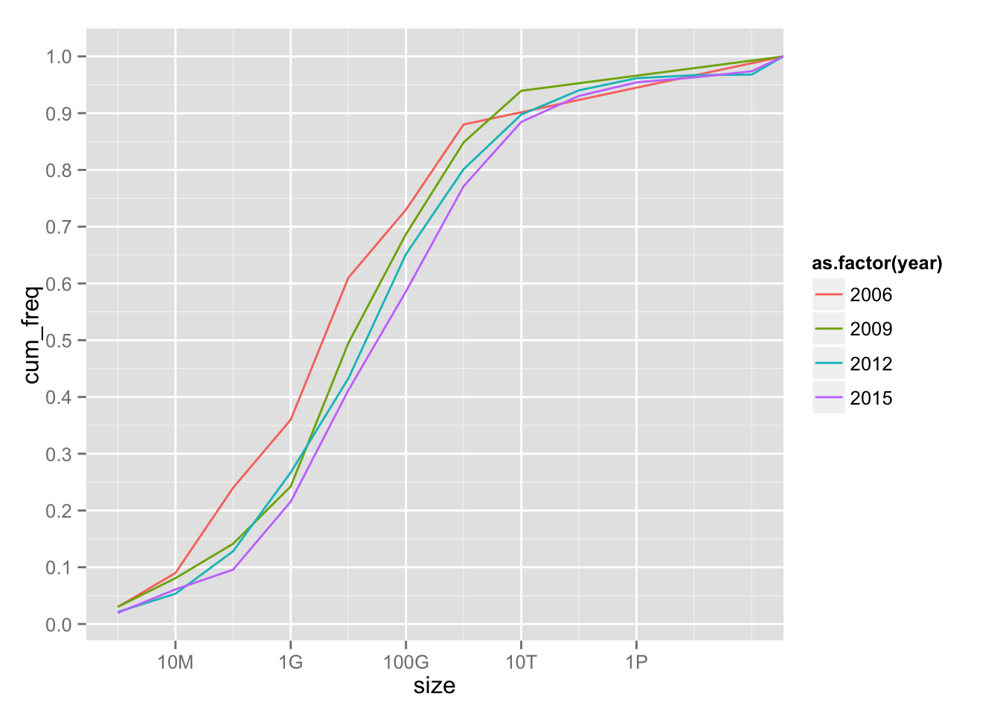
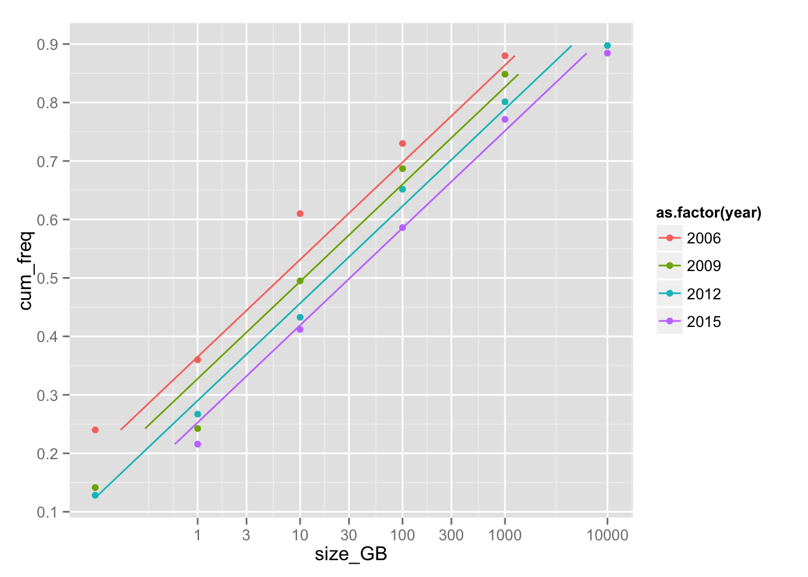

### Size of datasets used for analytics

With so much hype about "big data" and the industry pushing for "big data" analytical tools for everyone,
the question arises how many people have big data and how many of them really need these tools (which are more complex and 
often more immature compared to the traditional tools for data analysis).

During the process of data analysis we typically start with some larger raw datasets, 
we transform, clean and prepare them for modeling (typically with SQL-like 
transformations), and then we use these refined and usually smaller datasets for
modeling/machine learning.

In terms of computational resources needed I like to think in terms of the 
[pyramid of analytical tasks](https://github.com/szilard/datascience-latency#latency-numbers-every-data-scientist-should-know).
I'm mostly interested in tools for non-linear machine learning, the distribution of dataset sizes
practitioners have to deal with in this area, and how all this is changing in time.

#### Size of datasets in KDnuggets surveys

[KDnuggets](http://www.kdnuggets.com/) has conducted surveys of "the largest dataset you 
analyzed/data mined" (yearly since 2006).
It surveys the largest dataset for a given practitioner (instead of the typical one), it
measures size in bytes (rather than my preference for number of records), and it surveys
raw data sizes (I would be more interested in the size of the refined datasets used for modeling).
Nevertheless, it provides data points interesting to study. (One could also 
question the representativeness of the sample, changing respondents over the years etc.)

The annual polls are available on various [URLs](data/survey-urls.txt) 
and I compiled the data into a [csv file](data/dataset-sizes.csv).
The cummulative distribution of dataset sizes for a few select years is plotted below:

The dataset sizes vary over many orders of magnitude with most users in the 10 Megabytes to
10 Terabytes range (a huge range), but furthermore with some users in the many Petabytes range.

It seems the cummulative distribution function in the `0.1-0.9` range follows a linear dependecy 
vs `log(size)`:

Fitting a linear regression `lm(log10(size_GB) ~ cum_freq + year, ...)` for that range,
one gets coefficients `year: 0.075` and `cum_freq: 6.0`. We can use this "model" as a smoother
in the discussion below.

The above results imply an annual rate of increase of datasets of `10^0.075 ~ 1.2` that is 20%. 

The median dataset size increases from 6 GB (2006) to 30 GB (2015). That's all tiny, even more for
raw datasets, and it implies that over 50% of analytics professionals work with datasets
that (even in raw form) can fit in the memory of a single machine, therefore it can be definitely dealt 
with using simple analytical tools.

On the other hand, the dataset sizes are distributed over many orders of magnitude,
e.g. the larger quantiles based on smoothing for 2015 are:

quantile  |  value
----------|---------
50%       |  30 GB
60%       |  120 GB
70%       |  0.5 TB
80%       |  2 TB
90%       |  8 TB

The Terabyte range is the home turf of data warehouses, MPP/analytical databases and the like, but
many organizations are trying to use "big data" tools for those sizes. 

About 5% of uses are in the Petabytes range and likely need big data tools like Hadoop or Spark. 
While the hype around big
data, "exponential growth" of sensors and Internet-of-Things (IoT) etc. suggests a more rapid growth
rate than 20% yearly, the simple linear fit used above does not extend over the 90% percentile and 
it's hard to tell any trends for these large sizes from this survey data.

##### Size of datasets in other studies

A [Microsoft research study](http://research.microsoft.com/pubs/163083/hotcbp12%20final.pdf) 
has found that the median size of input jobs submitted to an analytic production Hadoop cluster 
at Microsoft in 2011 was 14 GB, and it infers from other studies that the median 
data size of input jobs in a Yahoo production cluster was 12 GB, while 90% of the inputs in a
analytical production cluster at Facebook were of size less than 100 GB.

#### Size of datasets for modeling

Unfortunately it is unclear from all this discussion above what's the distribution of dataset sizes used for 
modeling/machine learning (my primary area of interest). Some informal surveys I have
done at various [meetups and conference talks](https://github.com/szilard/talks) suggest that for 
at least 90% of non-linear supervised learning use cases the data fits well in the RAM of a single machine 
and can be processed by high-performant tools like xgboost or H2O or in many cases (I estimate 60%) even by
using R packages or Python sklearn
(see [this github repo](https://github.com/szilard/benchm-ml)
for a benchmark of the most commonly used open source tools for non-linear supervised learning).
Many of the "big data" tools in this domain (non-linear supervised learning) 
are clunky, slow, memory-inefficient and buggy (affecting predictive accuracy).

#### Size of RAM of single machine

The [size of EC2 instances](https://aws.amazon.com/blogs/aws/ec2-instance-history/) with largest RAM:

year  | type        | RAM (GB)
------|-------------|--------
2007  | m1.xlarge   |   15
2009  | m2.4xlarge  |   68
2012  | hs1.8xlarge |  117
2014  | r3.8xlarge  |  244
2016* | x1          |  2 TB

With different assumptions one can get yearly RAM increase rates of 50%, 60% or 70%:

from year |  from GB  |   to year  | to GB     |  rate
----------|-----------|------------|-----------|--------
2007      |    15     |    2014    |   244     |  50%
2007      |    15     |    2016    |   2000    |  70%
2009      |    68     |    2016    |   2000    |  60%

Either way, the rate of increase of RAM of a single machine is much higher than the
rate of increase of the typical dataset used for analytics (20%). This has huge
implications in terms of in-memory (distributed) processing (e.g. SQL) and 
single-machine processing (e.g. non-linear machine learning). 
Big RAM is eating big data.

